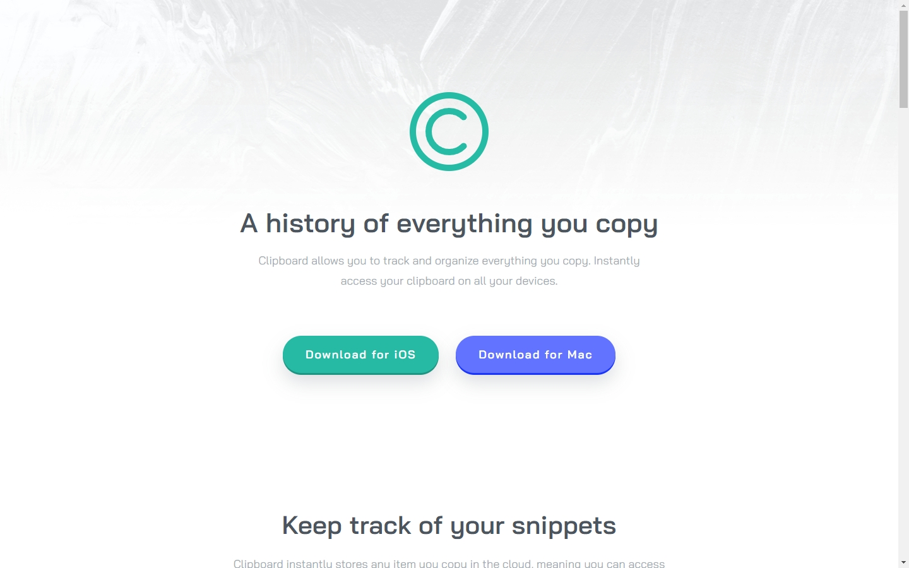

# Frontend Mentor - Clipboard landing page solution

This is a solution to the [Clipboard landing page challenge on Frontend Mentor](https://www.frontendmentor.io/challenges/clipboard-landing-page-5cc9bccd6c4c91111378ecb9). Frontend Mentor challenges help you improve your coding skills by building realistic projects.

## Table of contents

- [Overview](#overview)
  - [The challenge](#the-challenge)
  - [Screenshot](#screenshot)
  - [Links](#links)
- [My process](#my-process)
  - [Built with](#built-with)
  - [What I learned](#what-i-learned)
  - [Continued development](#continued-development)
  - [Useful resources](#useful-resources)
- [Author](#author)
- [Acknowledgments](#acknowledgments)

## Overview

### The challenge

Users should be able to:

- View the optimal layout for the site depending on their device's screen size
- See hover states for all interactive elements on the page

### Screenshot



### Links

- Solution URL: [Add solution URL here](https://your-solution-url.com)
- Live Site URL: [https://clipboard-landing-page-lf.netlify.app/](https://clipboard-landing-page-lf.netlify.app/)

## My process

### Built with

- Semantic HTML5 markup
- SASS
- Flexbox
- CSS Grid
- Mobile-first workflow

### What I learned

This project allow me to learn to use SASS partials. I also learned to use SASS mixins for media queries and how to use blocks of CSS in mixins for commonly used CSS. Examples of these are below:

```scss
// Displays content as Flex, centering it both horizontally
// and vertically as well as specifying flex-direction
@mixin flex-center($direction: row) {
  display: flex;
  flex-direction: $direction;
  justify-content: center;
  align-items: center;
}

// Mixin alternative for media queries.
// Uses breakpoint variables from __variables.scss
@mixin breakpoint($min, $max: null) {
  @if $max {
    @media (min-width: $min) and (max-width: ($max - 1px)) {
      @content;
    }
  } @else {
    @media (min-width: $min) {
      @content;
    }
  }
}
```

This project also allowed me to apply the use of fluid typography, allowing the font-sizes to change across different breakpoints. Through asking AI how to improve my code, I learned about BEM and how to apply BEM to my project, to make my code more readable and maintainable when combined with SASS.

Overall, the major learning outcomes was further improving my skills and knowledge of SASS.

### Continued development

For future projects, I will continue to apply fluid typography, and utlise SASS concepts such as partials, mixins and nesting.

### Useful resources

- [VS Code Gemini Assistant](https://marketplace.visualstudio.com/items?itemName=Google.geminicodeassist) - Used to help solve some challenges that I came across. Also used to help identify how to improve my code.

- [BEM Website](https://getbem.com/naming/) - After being suggested to use BEM by use of AI, I found this resource which helped me to understand BEM and how to incorporate it into my project

- [nekoCalc](nekoCalc) - A common resource I use, to convert px to rem for improved responsive websites.

## Author

- Website - [Liza Fernandez](https://lizafernandez.dev)
- Frontend Mentor - [@aelvanna](https://www.frontendmentor.io/profile/aelvanna)

## Acknowledgments

Google for their Gemini AI Assistant, which was helpful for improving my code and providing solution to any challenges that arose in the process of completing this challenge.
